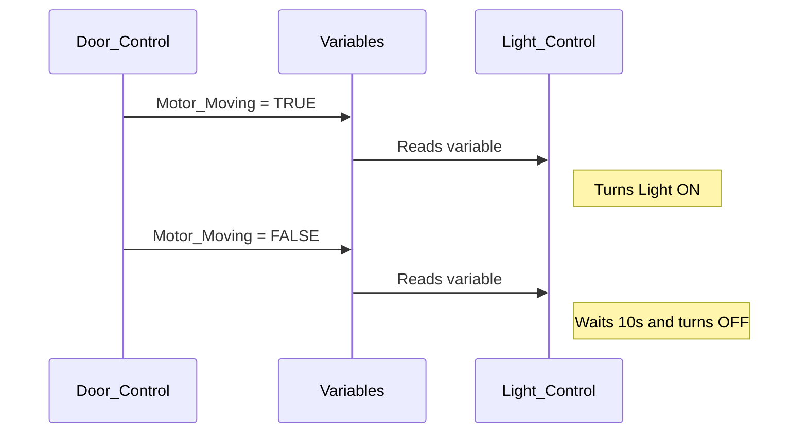

### Task Interaction
How tasks talk using variables.

```mermaid
sequenceDiagram
    Door_Control->>Variables: Motor_Moving = TRUE
    Variables->>Light_Control: Reads variable
    
    Note right of Light_Control: Turns Light ON
    
    Door_Control->>Variables: Motor_Moving = FALSE
    Variables->>Light_Control: Reads variable
    
    Note right of Light_Control: Waits 10s and turns OFF
```